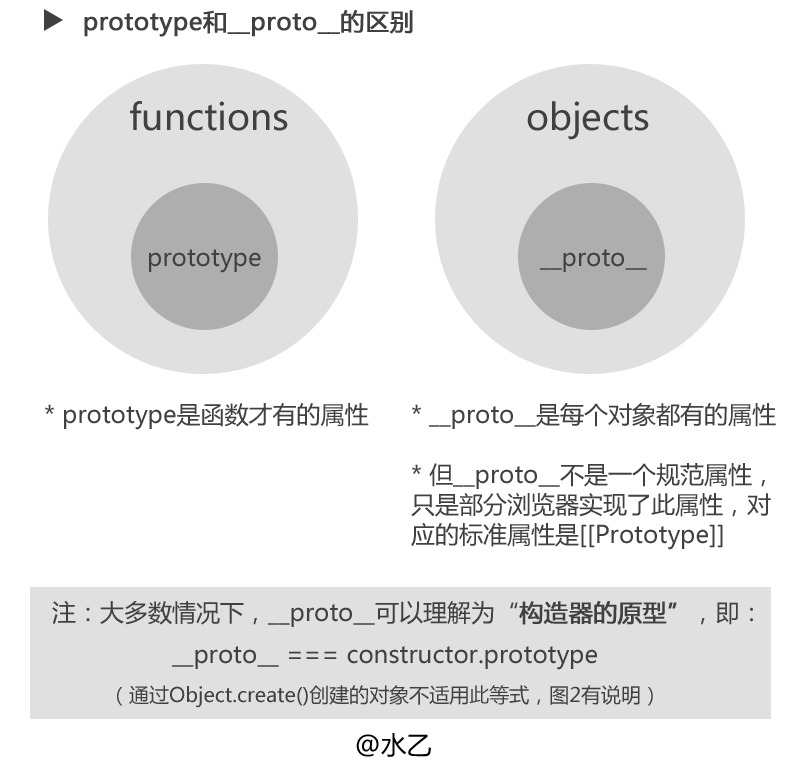

[HTML5](#html5)
[ES6](#es6)
[算法](#算法)
[框架](#框架)

## HTML5

#### 1.什么是 web socket ？

- web socket 协议本质上是一个基于 TCP 协议。一般用于聊天窗等场景，使用 ws（不加密） 或 wss（加密） 的统一资源标志符
- 很多网站为了实现推送技术，都是使用轮询，由浏览器对服务器发出 HTTP 请求，然后由服务器返回最新的数据给客户端的浏览器。浏览器需要不断的向服务器发出请求，然而 HTTP 请求可能包含较长的头部，其中真正有效的数据可能只是很小的一部分，这样会浪费很多的带宽等资源。HTML5 定义的 WebSocket 就能解决这个问题。
- **客户端和服务端进行交互的方式可以理解为 http 握手加 tcp 数据传输的方式**
  （1）浏览器发送 HTTP 请求，这个请求和通常的 HTTP 请求不同，包含 了一些附加头信息，其中附加头信息"Upgrade: WebSocket"表明这是一个申请协议升级的请求等候服务器响应；
  （2）服务器端解析这些附加的头信息然后产生应答信息返回给客户端；
  （3）客户端和服务器端的 WebSocket 连接成功，双方就可以通过这个连接通道自由的传递信息
  （4）服务可以主动响应给客户端，并且这个连接会持续存在直到某一方主动的关闭连接

#### 1.什么是 web worker ？

- web worker 提供多线程，提高 web 应用计算效率。当在 HTML 页面中执行脚本时，页面的状态是不可响应的，直到脚本已完成。而 web worker 是运行在后台的 JavaScript，独立于其它脚本，不会影响页面性能。一般用于更耗费 CPU 资源的任务。
- **注意：**
  - 除了 DOM 操作，任何 js 脚本都可以放入 web worker
  - 由于语法限制，不能跨越访问 js -创建 web worker 对象后，它会继续监听消息（即使外部脚本执行完成）直到使用 terminate() 终止。

## JavaScript

#### 1.js 对象和数组的区别

    对象是包含已命名值的无序集合，而数组是包含已编码的值的有序集合。
    许多编程语言中有中叫“关联数组”的东西，但在js中不推荐使用，因为js中关联数据底层就是转为对象。

#### 2.js 什么是闭包

    闭包是一种保护私有变量的机制，在函数执行是形成私有的作用域，保护里面的私有变量不受外界干扰。

```js
function add() {
  var counter = 0;
  return (counter += 1);
}

add();
add();
add();

// 本意是想输出 3, 但事与愿违，输出的都是 1 !

// 使用闭包创建私有变量

var add = (function () {
  var counter = 0;
  return function () {
    return (counter += 1);
  };
})();

add();
add();
add();

// 计数器为 3
```

#### 3.什么是同步和异步，说说原因以及原理

javascript 语言是一门“单线程”的语言，就像一条流水线，要么加工，要么包装，不能同时进行多个任务和流程。

- 同步：指在主线程上排队执行的任务，只有前一个任务执行完毕，才能继续执行下一个任务，当我们打开网站时，网站的渲染过程，比如元素的渲染，其实就是一个同步任务
- 异步：指不进入主线程，而进入任务队列的任务，只有任务队列通知主线程，某个异步任务可以执行了，该任务才会进入主线程，当我们打开网站时，像图片的加载，音乐的加载，其实就是一个异步任务

> **原因:**
> 因为 JavaScript 的单线程，因此任务都需要排队，前一个任务执行完，才能继续执行下一个任务，但是，如果前一个任务的执行时间很长，不得不等到所有数据都获取完毕才能进行下一步操作，用户只能在那里干等着，严重影响用户体验。

为了解决这个问题在主线程之外浏览器添加了"任务队列"，任务队列中分为“宏任务”与“微任务”，先执行微任务再执行宏任务

> **异步运行机制如下:**
> （1）所有同步任务都在主线程上执行，形成一个执行栈（execution context stack）。
> （2）主线程之外，还存在一个"任务队列"（task queue）。只要异步任务有了运行结果，就在"任务队列"之中放置一个事件。（事件就是回调函数，用于触发函数的执行）。
> （3）一旦"执行栈"中的所有同步任务执行完毕，系统就会读取"任务队列"，看看里面有哪些事件。那些对应的异步任务，于是结束等待状态，进入执行栈，开始执行。
> （4）主线程不断重复上面的第三步。

只要主线程空了，就会去读取"任务队列"，这就是 JavaScript 的运行机制。这个过程会不断重复

#### 4.什么是原型链

> 由于\_\_ **proto** \_\_是任何对象都有的属性，而 js 里万物皆对象，所以会形成一条\_\_ **proto** \_\_连起来的链条，递归访问\_\_ **proto** \_\_最终到头，并且值是 null ,这个链子就叫原型链。

#### 5.为什么要有是原型链

- （1）原型链的由来继承机制的设计思想

  > JavaScript 的创始人 Brendan Eich 在设计"继承"机制时参考 Java 语言使用 new 命令，用来从原型对象生成一个实例对象。
  > 但是，Javascript 没有"类"的概念，怎么来表示原型对象呢？这时，他想到 C++和 Java 使用 new 命令时，都会调用"类"的构造函数（constructor）。
  > 他就做了一个简化的设计，在 Javascript 语言中，new 命令后面跟的不是类，而是构造函数。

- （2）new 运算符的缺点

  > 用构造函数生成实例对象，有一个缺点，那就是无法共享属性和方法。

- （3）prototype 属性的引入
  > 考虑到这一点，Brendan Eich 决定为构造函数设置一个 prototype 属性。
  > 这个属性包含一个对象，所有实例对象需要共享的属性和方法，都放在这个对象里面；那些不需要共享的属性和方法，就放在构造函数里面。
  > 实例对象一旦创建，将自动引用 prototype 对象的属性和方法。也就是说，实例对象的属性和方法，分成两种，一种是本地的，另一种是引用的

#### 5.prototype 和**proto**的区别



## ES6

#### 1.JavaScript 中普通函数和箭头函数区别

1.this 方面：

    普通函数内部的this，谁调用的就指向谁，默认指向window，严格模式下指向undefined；
    箭头函数内部的this，与上一级作用域中的this指向同一个地方，而不是谁引有它this指向谁。

原理: 因为是箭头函数根本没有自己的 this，导致内部的 this 就是外层代码块的 this。正是因为它没有 this，所以也就不能用作构造函数。

2.arguments 方面：

    普通函数，可以通过arguments来实现重载；
    箭头函数中，没有arguments，代替它功能是剩余参数rest（...）。

3.原型对象方面：

    普通函数，是有自己的原型对象的；
    箭头函数，没有原型对象。

4.new 方面：

    普通函数，可以作为构造函数，通过new实例化出子函数；
    箭头函数，不能作为构造函数，使用new会报错。

5.简易程度：

    箭头函数比普通函数的使用简短更多；同时箭头函数通常是匿名函数。

#### 2.promise 的使用,同时处理多个异步请求

使用 Promise.all()方法,同时处理多个异步请求，Promise.all(iterable) 方法返回一个 Promise 实例，此实例在 iterable 参数内所有的 promise 都“完成（resolved）”或参数中不包含 promise 时回调完成（resolve）；如果参数中 promise 有一个失败（rejected），此实例回调失败（reject），失败原因的是第一个失败 promise 的结果。

```js
var promise1 = Promise.resolve("promise1");
var promise2 = new Promise(function (resolve, reject) {
  setTimeout(resolve, 2000, "promise2");
});
var promise3 = new Promise(function (resolve, reject) {
  setTimeout(resolve, 1000, "promise3");
});

Promise.all([promise1, promise2, promise3]).then(function (values) {
  console.log(values);
});
// expected output: Array ["promise1","promise2", "promise3"]
```

## 算法

#### 1.找出一维数组中出现最多的对象和次数

```js

function findMost(arr) {
  if (!arr.length) return;
  if (arr.length === 1) return 1;
  let res = new Map;
  let maxName, maxNum = 0
  // 遍历数组
  for (let i = 0; i < arr.length; i++) {
    let item = JSON.stringify(arr[i]) //字符串方便比较
    res[item] ? res[item] += 1 : res[item]1 //对象保存为key 次数保存为value
    if (res[item] > maxNum) {
      maxName = item
      maxNum = res[item]
    }
  }
  return '出现次数最多的对象为:' + JSON.parse(maxName) + ', 出现次数为:' + maxNum;
}

```

#### 2.乱序数组使其随机打乱的概率相同，却不会落在原来的位置

```js
// 洗牌算法
function shuffle() {
  let length = arr.length,
    r = length,
    rand = 0;
  while (r) {
    // Math.floor()方法可对一个数进行下舍入取整数
    rand = Math.floor(Math.random() * r--);
    //添加判断防止落在原来的位置
    if (r != 0 && r == rand) {
      r++;
    } else {
      [arr[r], arr[rand]] = [arr[rand], arr[r]];
    }
  }
  return arr;
}
```

#### 3.判断一个数是否是素数(质数)

```js

function primeNumber(num) {
  let count = 0; //因子和
  for (var i = 1; i <= num; i++) {
    if (num % i == 0) { //因子
      count++;
    }

  if (count == 2) {
    console.warn(num + "是素数");
  } else {
    console.warn(num + "不是素数");
  }
}

```

#### 4.JS 写斐波那契数列

```js
//  方法1：递归
function fb1(n) {
  if (n <= 2) {
    return 1;
  } else {
    return fb1(n - 1) + fb1(n - 2);
  }
}
// 方法1的递归方法基础上进行尾调用优化：
function fb2(n, res1 = 1, res2 = 1) {
  if (n <= 2) {
    return res2;
  } else {
    return fb2(n - 1, res2, res1 + res2);
  }
}
```

#### 5.JS 数组去重

```js

 //循环去重，不包括对象,对象去重需要先转String
function distinct(arr) {
  let newArr = []
  for (let i = 0; i < arr.length; i++) {
    if (!newArr.includes(arr[i])) {
      newArr.push(arr[i])
    }
  }
  return newArr

// es6数组去重
function distinct2(arr) {
  let newArr = [...new Set(arr)]
  return newArr
}
// 思路
//对象去重
//先排序相邻去重，可使用正则

```

#### 6.JS 数组排序

```js
//冒泡排序,性能一般
var arr = [1, 5, 7, 9, 16, 2, 4];
//每一趟找出最大的,总共比较次数为arr.length-1次,每次的比较次数为arr.length-1次，依次递减
var temp;
for (var i = 0; i < arr.length - 1; i++) {
  for (var j = 0; j < arr.length - 1; j++) {
    if (arr[j] > arr[j + 1]) {
      temp = arr[j];
      arr[j] = arr[j + 1];
      arr[j + 1] = temp;
    }
  }
}

// 插入排序
var ary = [45, 1, 32, 21, 56, 87, 43, 12, 34, 45];
// 有新获取到的数与当前数组中的数做比较，如果大于当前的数就插入到后面
function insertSort(ary) {
  var newAry = [];
  newAry.push(ary[0]);
  for (var i = 1; i < ary.length; i++) {
    var cur = ary[i];
    for (var j = newAry.length - 1; j >= 0; ) {
      if (cur < newAry[j]) {
        j--;
        if (j === -1) {
          newAry.unshift(cur);
        }
      } else {
        newAry.splice(j + 1, 0, cur);
        break;
      }
    }
  }
}

// 快速排序,性能最好
// 获取数组的中间项，然后对数组进行循环，判断数组每一项和这个中间项进行比较，比中间项小的放在左边数组，比中间项大的放进右边的数组；然后通过递归对左边数组右边数组进行同样的处理，最后把每一个数组和中间项拼接在一起；
function quickSort(ary) {
  // 当数组长度为一时，不需要再递归
  if (ary.length <= 1) {
    return ary;
  }
  // 计算中间项的索引，偶数项取中间两项后面一项，奇数项取中间项
  var index = Math.floor(ary.length / 2);
  // splice  : 返回值是一个数组，通姑索引获取中间项
  var middle = ary.splice(index, 1)[0];
  var left = [];
  var right = [];
  for (var i = 0; i < ary.length; i++) {
    var cur = ary[i];
    if (cur < middle) {
      left.push(cur);
    } else {
      right.push(cur);
    }
  }
  return quickSort(left).concat(middle, quickSort(right));
}
```

#### 7.有一组数字，从 1 到 n（假设 n=10000），从中任意删除了 3 个数，顺序也被打乱，剩余数字放在一个 n-3 的数组里，请找出丢失的数字

```js
function distinct(defectArr) {
  let newArr = Array(defectArr.length + 3);
  let lostArr = []; //缺失的数
  for (let i = 0; i < defectArr.length; i++) {
    newArr[defectArr[i]] = 1;
  }
  for (let j = 0; j < newArr.length; j++) {
    if (!newArr[j]) {
      lostArr.push(j);
    }
  }
  lostArr.shift(0); //删除第一个数字0
  return lostArr;
}

function a() {
  let b = {};
  let c = new Function();
  console.log(b);
  console.log(c);
}
a();
```

## 框架

#### 1.MVC 和 和 MVVM 的区别

MVC 和 MVVM 其实区别并不大，都是一种设计思想， MVC 和 MVVM 的区别并不是 VM 完全取代了 C，只是在 MVC 的基础上增加了一层 VM，只不过是弱化了 C 的概念， ViewModel 存在目的在于抽离 Controller 中展示的业务逻辑，而不是替代 Controller，其它视图操作业务等还是应该放在 Controller 中实现，也就是说 MVVM 实现的是业务逻辑组件的重用， 使开发更高效，结构更清晰，增加代码的复用性

  MVC：具有 view（视图）,controller（控制器）,model（数据），使用 MVC 的目的就是将 M 和 V 的代码分离,模式是单项绑定，也就是 View 跟 Model，必须通过 Controller 来承上启下

  > model 负责数据保存，与后端数据进行同步
  > controller 负责业务逻辑，根据用户行为对 model 数据进行修改
  > view 负责视图展示，将 model 中的数据可视化出来

  缺点：
  - （1）强行分层，一个小小的功能都必须经过这么一个流程，并不灵活;
  - （2）视图与控制器间的过于紧密的连接,妨碍了他们的独立重用;
  - （3）不适合小型项目的开发;

  MVVM:具有 view（视图）,model（数据）,viewModel（控制器）,viewModel 通过一>套数据响应机制自动响应 model 中数据变化,通过监听 view 中用户交互操作修改 >model 中数据，这样在 viewModel 中就减少了大量 DOM 操作代码,模式是双向绑定。
 
  优点：
  - （1）数据驱动使开发更高效
  - （2）结构更清晰，增加代码的复用性

#### 2.Vue2.0/3.0 双向数据绑定实现原理

Vue2.0：使用 ES5 的 object.defineProperty 来劫持对象属性的 getter 和 setter 操作，当数据发生变化时发出通知,不包括数组。
Vue3.0：使用 ES6 的 Proxy 来劫持数据，当数据发生变化时发出通知。

```html
<div>
  <input type="text" id="input" />
  <span id="text"></span>
</div>
```

```js
// vue2.x双向绑定实现
var obj = {};
Object.defineProperty(obj, "prop", {
  get: function () {
    return val;
  },
  set: function (newVal) {
    val = newVal;
    document.getElementById("text").innerHTML = val;
  },
});
document.addEventListener("keyup", function (e) {
  obj.prop = e.target.value;
});

// vue3.x双向绑定实现
var obj = {};
var obj1 = new Proxy(obj, {
  // target就是第一个参数obj, receive就是返回的obj(返回的proxy对象)
  get: function (target, key, receive) {
    // 返回该属性值
    return target[key];
  },
  set: function (target, key, newVal, receive) {
    // 执行赋值操作
    target[key] = newVal;
    document.getElementById("text").innerHTML = target[key];
  },
});
document.addEventListener("keyup", function (e) {
  obj1[0] = e.target.value;
});
```

#### 3.Vue2.0 如何检测数组变化

数组考虑性能原因没有用 Object.defineProprty 对数组的每一项进行拦截，而是选择数组方法（push，shift，pop，splice，nbshift，sort，reverse）进行重写。
**补充：** 修改数组索引和长度是无法监控到的要使用 Vue.$set()方法。

#### 4.Vue v-ifv-if 和 v-for 谁的优先级高？如何正确的避免性能问题？

v-for 优于 v-if 被解析，如果同时出现，每次渲染都会先执行循环再判断条件，这样就浪费了性能。

#### 5.Vue 组件 data 为什么必须是函数而 Vue 根实例没有这个限制？

Vue 组件可能存在多个实例，如果使用对象定义 data，会导致它们共用一个 data 对象，那么状态变更将会影响其他实例，这是不合理的；
采用函数形式定义，在 initData 时会将其作为工厂函数返回全新 data 对象，有效规避多个实例之间状态污染问题；
而在 vue 根实例创建过程则不存在该限制，因为根实例只有一个。

#### 6.说说 Vue 中 key 的作用和工作原理

- （1）key 的作用是为了高效的更新虚拟 dom，其原理是 vue 在 patch 过程中通过 key 可以精准判断两个节点是否相同，从而避免频繁更新不同元素，减少 dom 操作，提高性能。
- （2）另外，若不设置 key 还可能在列表更新时引发一些隐蔽的 BUG

#### 7.说说 Vue 中 diff 算法

- （1）diff 算法是虚拟 dom 技术的必然产物，通过新旧虚拟 dom 做对比，将变化的地方更新在真实 dom 上；另外，也需要 diff 高效的执行对比过程，从而降低时间复杂度为 0。
- （2）vue 中 diff 执行的时刻是组件实例执行更新函数时，它会对比上次渲染结果 oldVnode 和新的渲染结果 newVnode，此过程称为 patch。
- （3）diff 过程整体遵循深度优先，同层比较的策略；两个节点之间比较会根据它们是否拥有子节点或文本节点做不同操作；比较两组子节点是重点是，首先假设头尾节点可能相同做 4 次对比尝试，如果没有找到相同节点就遍历查找，查找结果再按情况处理剩下的节点；借助 key 通常可以非常精准的找到相同节点，因此整个 patch 过程非常高效。

#### 8.说说对 Vue 组件化的理解

- （1）组件是独立和可复用的代码组织单元，组件系统是 Vue 的核心特效之一，它使开发者使用小型，独立和可复用的组件构建大型应用；
- （2）组件化能大幅提高应用开发效率，测试性，复用性等；
- （3）组件使用按分类有：页面组件，业务组件，通用组件；
- （4）vue 组件是基于配置的，我们通常编写的组件是组件配置非组件，框架后续会生成构造函数，它们基于 vueComponent，扩展于 vue；
- （5）vue 常见的组件化技术有：属性 porp，自定义事件，插槽等，它们主要用于组件通信扩展等；
- （6）合理的划分组件，有助于提升应用性能；
- （7）组件应该是高内聚，低耦合的；
- （8）遵循单项数据流的原则。

#### 9.说说 Vue 性能优化的方法

- （1）路由懒加载
- （2）keep-alive 缓存页面
- （3）使用 v-show 复用 DOM
- （4）v-for 遍历避免使用 v-if
- （5）长列表性能优化

- 如果列表存粹是数据展示，不会有任何变化，就不需要响应化使用 Object.freeze()冻结
- 如果是大长列表，可以采用虚拟滚动，只渲染少部分区域。插件有 vue-virtual-scroller 等

- （6）图片懒加载
- （7）第三方插件设置按需引入
- （8）无状态的组件标记为函数式组件

```html
<template functional>
  <div class="cell">
    <div v-if="props.value" class="on"></div>
    <section v-else class="off"></section>
  </div>
</template>
​
<script>
  export default {
    props: ["value"],
  };
</script>
```

- (9）子组件分割

```html
<template>
  <div>
    <ChildComp />
  </div>
</template>
​
<script>
  export default {
    components: {
      ChildComp: {
        methods: {
          heavy() {
            /* 耗时任务 */
          },
        },
        render(h) {
          return h("div", this.heavy());
        },
      },
    },
  };
</script>
```

- (10)变量本地化

```html
<template>
  <div :style="{ opacity: start / 300 }">{{ result }}</div>
</template>
​
<script>
  import { heavy } from '@/utils'
  ​
  export default {
   props: ['start'],
   computed: {
   base () { return 42 },
   result () {
   const base = this.base // 创建一个常量不要频繁引用this.base
   let result = this.start
   for (let i = 0; i < 1000; i++) {
   result += heavy(base)
        }
   return result
      }
    }
  }
</script>
```

- (11)ssr 服务端渲染

#### 9.说说delete和Vue.delete删除数组的区别

delete只是被删除的元素变成了 empty/undefined 其他的元素的键值还是不变。
Vue.delete 直接删除了数组 改变了数组的键值。

```js
var a=[1,2,3,4]
    var b=[1,2,3,4]
    delete a[1]
    console.log(a)  //[1,empty,3,4]  [0:1 , 2:3 , 3:4]
    this.$delete(b,1)
    console.log(b)  //[1,3,4]  [0:1 , 1:3 , 2:4]
```